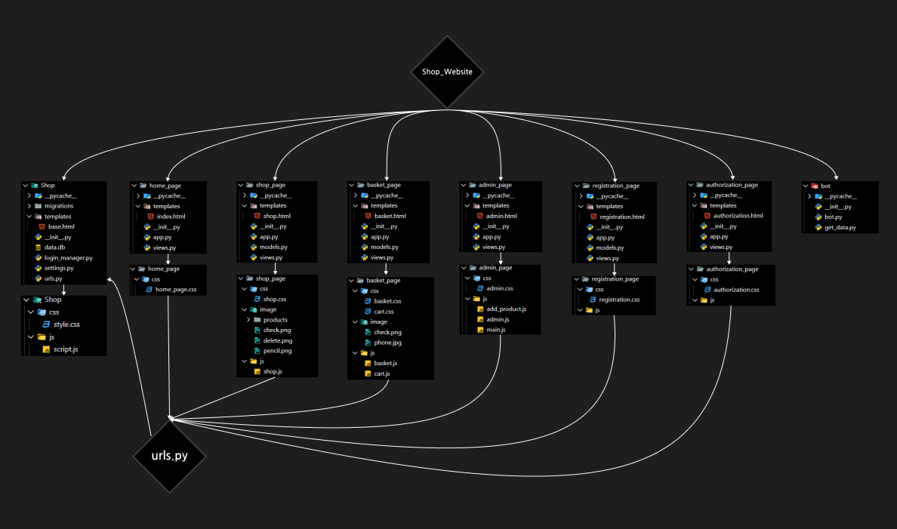

# SHOP WEBSITE

### OUR TEAM / НАША КОМАНДА

- Oleksandr Sakharov (https://github.com/SaschaOl)
- Anna Safonova (https://github.com/AnnaSafonova30)
- Matvii Sivaiev (https://github.com/MatviiSivaiev2009)
- Artem Derunov (https://github.com/ArtemDerunov2010)

## ABOUT THE PROJECT / ПРО ПРОЕКТ 

SHOP WEBSITE is an online shop application. It is intended to be a gadget store, however it can be easily modified for other purposes

SHOP WEBSITE це застосунок онлайн магазину. Він є задуманий як магазин ґаджетів, але може бути легко модифікоаний для  інших потреб

## HOW CAN IT BE USEFUL / ЧИМ ВІН МОЖЕ БУТИ КОРИСНИЙ

It can be useful for learners like us. They can analyze it to learn about the web-aplications, or use it as a base for their own projects
<br>
Also it was useful for us. Working on it gave us a lot of valuable knowledge and expirience in this direction and overall, since we have never worked with web-aplications before


Він може бути корисним для вчащихся як ми. Вони можуть аналізувати його щоб зрозуміти роботу веб-застосунків, або використати як основу для їх власних проектів
<br>
Також він був корисним для нас. Робота над ним принесла нам багато цінних знань та досвіду в цьому напрямку та взагалом, бо до цього ми ще ніколи не працювали з веб-застосунками

## HOW DO YOU USE IT / ЯК ПОЧАТИ ЇМ КОРИСТУВАТИСЬ

### USED TECHNOLOGIES / ЗАСТОСОВАНІ ТЕХНОЛОГІЇ

### Python 3.10

Main language of the project. Used for the back-end

Головна мова проекту. Використовувався для бек-енду

> Frameworks / Фреймворки:
> - Flask - work with web-appliication / робота з веб-застосунком
>
> - Telebot - used to make the managment bot / використаний для бота-менеджера

### JsvaScript

Was used for the front-end of the web-application and to work with cookie files

Використовувався для фронт-енду веб застосунку та для роботи з файлами cookie

### HTML 

Was used as the main markup language

Використовувався як основна мова для розмітки

### CSS

Was used for styling of the web-application

Використовувався для стилізування веб-застосунку

### NECESSARY PYTHON MODULES / НЕОБХІДНІ МОДУЛІ PYTHON

```python
flask==3.0.3
# Framwork for work with web-applications
# Фреймворк для роботи з веб-застосунками

flask_sqlalchemy==3.1.1
# Module for work with sqlite integratedly with flask
# Модуль для роботи з sqlite ітегровано з flask

flask_migrate==4.0.7
# Module for work with database: migrating, backuping,integrately with flask
# Модуль для роботи з базою данних: мігрування, бек-апинг, ітегровано з flask 

flask_login==0.6.3
# Module for stetting up a user system in a flask web-application
# Модуль для налаштування системи користувачів у веб-застосунку flask

flask_mail==0.10.0
# Module for work with email integratedly with flask
# Модуль для роботи з електронною поштою ітегровано з flask

telebot==0.0.5
# Framework for creating of telegram bots
# Фреймворк для створення телеграм ботів
```

### HOW TO RUN IT / ЯК ЙОГО ЗАПУСТИТИ

#### IN A LOCAL ENVIRONMENT / В ЛОКАЛЬНОМУ СЕРЕДОВИЩІ

1. Create a folder and `git clone` this repository into it
<br> Створіть папку та використовуючи `git clone` пренесіть у неї цей репозиторій

2. Make sure you have the correct version of python and install all required modules
<br> Перевірте чи ви маєте правилну правильну версію python та вствновіть усі необхідні модулі 

3. In the terminal go to the `Shop` directory and type in the following commands in the same order to set up the database:
<br> У терміналі перейдіть до директорії `Shop` та введіть в такому ж порядку наступні комманди, щоб налаштувати базу данних:
    >`flask --app settings db init`
    <br>
    >`flask --app settings db migrate`
    <br>
    >`flask --app settings db upgrade`

4. Run the `manage.py` file
<br> Запустіть файл `manage.py

#### ON A PYTHONANYWHERE SERVER / НА СЕРВЕРІ PYTHONANYWHERE

1. Go to the **Web** tab at the pythonanywhere website and click on the *Add a new web app* button
<br> Перейдіть до вакладки **Web** на сайті pythonanywhere та натисніть кнопку *Add a new web app*

2. From frameworks select `flask` and for python version select `3.10`
<br> Серед фреймворків виберіть `flask` та виберіть версію пайтона `3.10`

3. Then for the path set `/home/*Your domen name here*/mysite/manage.py`
<br> Потім встановіть шлях на  `/home/*Назва вашого домену*/mysite/manage.py`

4. Go to the **Databases** tab an intialize mysql
<br> Прерйдіть у вкладку **Databases** та ініціалізуйте mysql

5. In **Consoles** tab create a new bash console and enter it
<br> У вкладці **Consoles** створіть нову bash консоль

6. `git clone` this repository into the `mysite` folder
<br> Використовуючи `git clone` пренесіть у неї цей репозиторій

7. Then type in `mkvirtualenv --python==3.10` to create the virtual enviornment and `pip install` all the required modules
<br> Дала введіть `mkvirtualenv --python==3.10` щоб створити віртувальну середу та за допомогою `pip install` встановіть всі необходні модулі

8. Change the directory to `Shop` and type in the following commands in the same order to set up the database:
<br> Змініть директорію на `Shop` та введіть в такому ж порядку наступні комманди, щоб налаштувати базу данних:
    >`flask --app settings db init`
    <br>
    >`flask --app settings db migrate`
    <br>
    >`flask --app settings db upgrade`

9. Go to the *WSGI configuration file* and replace 16th row with `from Shop import shop_project as application`
<br> Прейдіть до *WSGI configuration file* та замініть 16-ту строчку на `from Shop import shop_project as application`

### DATABASE CHOICE / ВИБІР БАЗИ ДАННИХ

#### WHAT IS A DADTABASE / ЩО ТАКЕ БАЗА ДАННИХ

A database is an organized collection of structured information, or data, stored in a computer system. They are used to store all kinds of data for any purpose. A database is usually controlled by a *database management system* (DBMS)

База данних це організоване зібрання структурованих даних, або інформації, що зберігається в комп'ютерній системі. Вони використовуються щоб зберігати данні різних видів для будь-яких потреб. База данних зазвичай контролюється *системою управління базою даних* (СУБД)

#### WHY SQLITE3 / ЧОМУ SQLITE3

The DBMS that we chose is sqlite3, here are the reasons for it:
<br>
СУБД яку ми вибрали це sqlite3, ось на те причини:
- It is the most widely used DBMS
<br>Це найбільш поширеня СУБД
- It is built-in to python
<br>Вона вбудована в python
- it is easy to use and it statisfies our needs
<br>Вона легка у використвнні та задовольняє наші потреби

#### WHAT IS DATABASE ID / ЩО ЗНАЧИТЬ ID В БАЗАХ ДАННИХ

ID is the identificator for database rows. It is used to adress them and it is uniqe for each one

ID це ідентифікатор рядку в базі данних. Він використовується в цілях звернення до них і є унікальним для кожної з них

## DETAILED DIVE / ПОГЛИБЛЕНИЙ РОЗБІР

### PROJECT STRUCTURE / СТРУКТУРА ПРОЕКТУ



---

<details>
<summary>Shop</summary>

<br>

`Shop` is the main project folder. It contains the `settings` file with all main settings and where the main application is created, as well as the `urls` file 
where all other applications are connected.


`Shop` Це головна папка проекту. Вона містить файл `settings` з усіма головними налаштуваннями та да створюється голоаний застосунок, а також файл `urls` де всі інші застосунки поєднані

### settings.py
```python
# Importing the necessary modules
import flask, flask_sqlalchemy, flask_migrate, flask_mail
import os

# Creating the main application with the Flask class
shop_project = flask.Flask(
    # The name of the application package
    import_name = "settings",
    # Path to the respective folder in static
    static_folder = "static",
    # Path to the templates folder
    template_folder = "Shop/templates",
    # Aplication folder path
    instance_path = os.path.abspath(__file__ + "/..")
)


# Setting the configuration for work with sqlite
shop_project.config['SQLALCHEMY_DATABASE_URI'] = "sqlite:///data.db"
# Configuring the SMTP mail server for work with mail
shop_project.config['MAIL_SERVER'] = "smtp.gmail.com"
# Configuring the mail port for work with mail
shop_project.config['MAIL_PORT'] = 587
# Configuring the use TLS to True for work with mail
shop_project.config['MAIL_USE_TLS'] = True
# Configuring the main email adrees for work with mail
shop_project.config['MAIL_USERNAME'] = "YOUR ADMINISTRATION MAIL ADRESS HERE"
# Configuring the main email application password for work with mail
shop_project.config['MAIL_PASSWORD'] = "YOUR ADMINISTRATION MAIL APPLICATION PASSWORD HERE"

# Creating database instance so we can do operations with it
database = flask_sqlalchemy.SQLAlchemy(app = shop_project)
# Creating Migration instance to make migrtions possible
migrate = flask_migrate.Migrate(app = shop_project, db = database)
# Creating the Mail class instance to manage the email messaging 
mail = flask_mail.Mail(app = shop_project)
```

### urls.py
```python
# Importing all the applications
import home_page
import authorization_page
import registration_page
import contacts_page
import basket_page
import shop_page
import admin_page
from .settings import shop_project

# Settins the url for home_page app
home_page.home_page_app.add_url_rule(
    rule = "/",
    view_func = home_page.show_home_page,
    methods = ["GET", "POST"]
)
# Registering the blueprint for home_page app
shop_project.register_blueprint(blueprint = home_page.home_page_app)

# Settins the url for registration_page app
registration_page.registration_page_app.add_url_rule(
    rule = "/registration/",
    view_func = registration_page.show_registration_page,
    methods = ["GET", "POST"]
)
# Registering the blueprint for registration_page app
shop_project.register_blueprint(blueprint = registration_page.registration_page_app)

# Settins the url for authorization_page app
authorization_page.authorizatiion_page_app.add_url_rule(
    rule = "/authorization/",
    view_func = authorization_page.show_authorizatiion_page,
    methods = ["GET", "POST"]
)
# Registering the blueprint for authorization_page app
shop_project.register_blueprint(blueprint = authorization_page.authorizatiion_page_app)

# Settins the url for basket_page app
basket_page.basket_page_app.add_url_rule(
    rule = "/basket/",
    view_func = basket_page.show_basket_page,
    methods = ["GET", "POST"]
)
# Registering the blueprint for basket_page app
shop_project.register_blueprint(blueprint = basket_page.basket_page_app)

# Settins the url for contacts_page app
contacts_page.contacts_page_app.add_url_rule(
    rule = "/contacts/",
    view_func = contacts_page.show_contacts_page,
    methods = ["GET", "POST"]
)
# Registering the blueprint for contacts_page app
shop_project.register_blueprint(blueprint = contacts_page.contacts_page_app)

# Settins the url for shop_page app
shop_page.shop_page_app.add_url_rule(
    rule = "/shop/",
    view_func = shop_page.show_page,
    methods = ["GET", "POST"]
)
# Registering the blueprint for shop_page app
shop_project.register_blueprint(blueprint = shop_page.shop_page_app)

# Settins the url for admin_page app
admin_page.admin_page_app.add_url_rule(
    rule = "/admin/",
    view_func = admin_page.show_page,
    methods = ["GET", "POST"]
)
# Registering the blueprint for admin_page app
shop_project.register_blueprint(blueprint = admin_page.admin_page_app)
```

### login_manager.py
```python
# Importing required modules
import flask_login
from .settings import shop_project
from registration_page.models import User

# Setting the secret key for rhe seesion (should be changed)
shop_project.secret_key = "1234567890"
# Creating Login Manager instance to work with users
login_manager = flask_login.LoginManager(shop_project)

# Decorator that ckecks if there is any atempt to load a user
@login_manager.user_loader
def load_user(id):
    # Returnig the User object from the database that will represtent the user
    return User.query.get(id)
```

### base.html
```html
<html lang="en">
    <head>
        <meta charset="UTF-8">
        <meta name="viewport" content="width=device-width, initial-scale=1.0">
        <title> </title>
        <link rel="stylesheet" href="{{ url_for('static', filename = 'Shop/css/style.css') }}">
        <link rel="stylesheet" href="">
        <script defer src = ""></script>
        <script defer src = "{{ url_for('static', filename = 'Shop/js/script.js') }}"></script>
    </head>
    <header>

        
        <div class = "header">
            
                
                    <a class="main-link page" href="/">HOME</a>
                
                    <a class="main-link " href="/">HOME</a>
                
                
                
                    <a class="main-link page" href="/shop/">SHOP</a> 
                
                    <a class="main-link" href="/shop/">SHOP</a> 
                
                
                
                    <a class="main-link basket page" href="/basket/">CART <p>0</p></a>
                
                    <a class="main-link basket" href="/basket/">CART <p>0</p></a> 
                
            
                
                    <a class = "main-link page" href="/contacts/">CONTACTS</a>
                
                    <a class = "main-link" href="/contacts/">CONTACTS </a>
                

                
                    
                        <a class="main-link admin page" href="/admin/">ADMIN</a>
                    
                        <a class="main-link" href="/admin/">ADMIN</a> 
                    
                
            
            <div class="top">
                
                    <p>{{ user_data["name"] }}</p>
                
                    <a href="/registration/">REGISTRATION</a>
                    <a href="/authorization/">AUTHORIZATION</a> 
                 
            </div>
        </div>
        
    </header>
    <body>
        
        
        
        

    </body>
</html>
```

### script.js
```js
let count_basket = document.querySelector(".basket p")

// Updating the basket product count value
if (document.cookie && document.cookie.split("=")[1] != "") {
    count_basket.style.display = "block"
    for (let cookie_id = 0; cookie_id < document.cookie.split("=")[1].split(" ").length; cookie_id++) {
        count_basket.innerHTML = Number(count_basket.innerHTML) + 1
    }
} else {
    count_basket.style.display = "none"
}
```
</details>

---

<details>
<summary>home_page</summary>

<br>

`home_page` is the folder that is responsible for the home page and its functionality. New users can got registration or authorization on this page

`home_page` це папка відповідальна за домашню сторінку та її функціонал. Нові користувачі можуть перейти до реєстрації, або авторизації на цій сторінці

### app.py
```python
# Importing flask
import flask

#  Creating the Blueprint that will represent the application
home_page_app = flask.Blueprint(
    # Setting the name for the application
    name = "home_app",
    # Setting the import name to the name of the current file
    import_name = "app",
    # Setting the template folder path
    template_folder = "home_page/templates",
    # Setting the static folder path
    static_folder = "static"
)
```

### views.py
```python
# Importing the rquiered modules
import flask
from flask_login import current_user, logout_user
import flask_login
from registration_page.models import User

# Creating the view function
def show_home_page():
    # Checking if the user is authenticated 
    if current_user.is_authenticated:
        # If so, setting is_admin to the value of the user
        is_admin = current_user.is_admin
    else:
        # If not, setting is_admin to False
        is_admin = False

    # Rendering the template and passing the data needed in it as parameters
    return flask.render_template(
        # Setting the template file name
        template_name_or_list = "index.html",
        # Passing the current_user.is_authenticated value as context argument
        is_auth = current_user.is_authenticated,
        # Passing the user data of the current user value as context argument
        user_data = User.query.get(current_user.id) if current_user.is_authenticated else None,
        # Passing the current page name as context argument
        page = "home",
        # Passing the is_admin value as context argument
        is_admin = is_admin
    )
```

### index.html
```html



    Home page



    {{ url_for("static", filename = "home_page/css/home_page.css") }}



    <div class="top">
        
            <a href="">{{ user_data["name"] }}</a>
        
            <a href="/registration/">REGISTRATION</a>
            <a href="/authorization/">AUTHORIZATION</a> 
         
    </div>



    <div class="title">
        <p>HOME PAGE</p>
    </div>

``` 
</details>

<details>
<summary>shop_page</summary>

<br>

`shop_page` is the folder responsible for the shop page and the products database. You can look for the products and add them to your cart on it

`shop_page` це папка відповідальна за сторінку магазину та базу данних продуктів. На ній можна передивлятися продукти та додавати їх до кошика

### app.py
```python
# Importing flask
import flask

#  Creating the Blueprint that will represent the application
shop_page_app = flask.Blueprint(
    # Setting the name for the application
    name = "shop_page",
    # Setting the import name to the name of the current file
    import_name = "app",
    # Setting the template folder path
    template_folder = "shop_page/templates",
    # Setting the static folder path
    static_folder = "static"
)
```

### models.py
```python
# Importing the rquiered modules
import flask, flask_sqlalchemy
# Importing the database instance from the settings file
from Shop.settings import database

# Creating the model class that extends the database.Model template class
class Product(database.Model):
    # Id primary key column, used as the main identifier, aincrement is set to flase to not reuse the ids
    id = database.Column(database.Integer, primary_key = True, autoincrement = False)
    # name stores the name of the product
    name = database.Column(database.String(120), nullable = False)
    # price stores the price value of the product
    price = database.Column(database.Integer, nullable = False)
    # memory_cap stores the memory capacity value of the product
    memory_cap = database.Column(database.Integer, nullable = False)
    # discound stores the discound value of the product
    discount = database.Column(database.Integer, nullable = False)
    # picture stores the picture file name of the product
    picture = database.Column(database.String(120), nullable = False)
```

### views.py
```python
# Importing the rquiered modules
import flask
from flask_login import current_user
from .models import Product
from Shop.settings import database
from registration_page.models import User

# Creating the view function
def show_page():
    # Checking if the user is authenticated 
    if current_user.is_authenticated:
        # If so, setting is_admin to the value of the user
        is_admin = current_user.is_admin
    else:
        # If not, setting is_admin to False
        is_admin = False

    # Rendering the template and passing the data needed in it as parameters
    return flask.render_template(
        # Setting the template file name
        template_name_or_list = "shop.html",
        # Passing the list of all products as context argument
        products = Product.query.all(), 
        # Passing the current page name as context argument
        page = 'shop', 
        # Passing the current_user.is_authenticated value as context argument
        is_auth = current_user.is_authenticated,
        # Passing the user data of the current user value as context argument
        user_data = User.query.get(current_user.id) if current_user.is_authenticated else None,
        # Passing the is_admin value as context argument
        is_admin = is_admin
        )
```

### shop.html
```html



    Shop



    {{ url_for("static", filename = "shop_page/css/shop.css") }}



    {{ url_for("static", filename = "shop_page/js/shop.js") }}



    
        <div class = "product">
            <div class = "photo-div">
                
            </div>
            <div class = "info">
                <div class="name-div">
                    <p class = "name">{{ product.name }}</p>
                    
                </div>
                
                    <div class="olp-price-div">
                        <p class="old-price">{{ product.price }} грн</p>
                        
                    </div>
                    <div class="discount-div">
                        <p class="discount">Знижка {{ product.discount }}%</p>
                        
                    </div>
                
                <div class="price-count-div">
                    <span class="price">
                        
                            <p class = "price-count">{{ product.price - product.price * product.discount // 100 - 1}}</p> 
                            <!-- 2000 - 2000 * 20 // 100 -->
                        
                            <p class = "price-count">{{ product.price }}</p> 
                        
                        
                        <p class ="currency">грн</p>
                    </span>
                </div>
                <button class = "purchase-button" id = "{{ product.id }}">КУПИТИ</button>
                <p class = "cap">ЄМНІСТЬ:</p>
                <div class = "lower">
                    <div class="memory-cap-div">
                        <p class = "memory-cap">{{ product.memory_cap }}</p>  
                    </div>
                    <span>
                         
                        <p class = "in-sale">ТОВАР В НАЯВНОСТІ</p>
                    </span>
                </div>
            </div>
        </div>
    

```

### shop.js
```js
const button_list = document.querySelectorAll(".purchase-button")
const basket = document.querySelector(".basket p")

// Adding functionality to all "buy" buttons:
// Adding the product id to the cookie files 
for (let button_id = 0; button_id < button_list.length; button_id++) {
    let button = button_list[button_id]
    button.addEventListener('click', function () {
        if (document.cookie != "") {
            let product_id = document.cookie.split("=")[1]
            let product = product_id + " " + button.id
            document.cookie = `product = ${product}; path = /`
        }
        else {
            document.cookie = `product = ${button.id}; path = /`
        }
        window.location.reload()
    })
}
```

</details>

<details>
<summary>basket_page</summary>

<br>

`basket_page` is the folder responsible for the basket page and its functionality. There you can overview and manage your cart (add and decrease products amount), also you can submit your order here

`basket_page` це папка відповідальна за сторінку кошика та її функціонал. На ній можна предивлятись та керувати своїм кошиком (збільшувати та зменшувати кількість продуктів), а також підтверджувати замовлення

### app.py
```python
# Importing flask
import flask

#  Creating the Blueprint that will represent the application
basket_page_app = flask.Blueprint(
    # Setting the name for the application
    name = "basket_page",
    # Setting the import name to the name of the current file
    import_name = "app",
    # Setting the template folder path
    template_folder = "basket_page/templates",
    # Setting the static folder path
    static_folder = "static"
)
```

### models.py
```python
# Importing the required modules 
import flask, sqlalchemy
# Importing the database instance from the settings file
from Shop.settings import database

# Creating the model class that extends the database.Model template class
class Cart(database.Model):
    # Id primary key column, used as the main identifier
    id = database.Column(database.Integer, primary_key = True)
    # user_id column stores id of the user who did this order
    user_id = database.Column(database.Integer, nullable = True)
    # name stores the name of that user
    name = database.Column(database.String, nullable = False)
    # surname stores the surname of that user
    surname = database.Column(database.String, nullable = False)
    # number_user stores the phone number of that user
    number_user = database.Column(database.Integer, nullable = False)
    # email_user stores the email of that user
    email_user = database.Column(database.String, nullable = False)
    # city_user stores the city of that user
    city_user = database.Column(database.String, nullable = False)
    # nova_poshta stores the chosen nova post site of that user
    nova_poshta = database.Column(database.String, nullable = False)
    # additional_wishes stores the entered additional wishes of that user
    additional_wishes = database.Column(database.String, nullable = False)
    # price stores the total price of the order
    price = database.Column(database.Integer, nullable = False)
    # products stores the list of ids if ordered products
    products = database.Column(database.String, nullable = False)
    # is_done shows if the order is done
    is_done = database.Column(database.Boolean, nullable = False)#
    # is canceled shows if the order is canceled
    canceled = database.Column(database.Boolean, nullable = False)
```

### views.py 
```python
# Importing the rquiered modules
import flask
import telebot
from shop_page.models import Product
from registration_page.models import User
from flask_login import current_user
from .models import Cart
from Shop.settings import database
from flask_mail import Message
from Shop.settings import mail


# Creating the view function
def show_basket_page():

    # List that will represent the products in the user's cart
    list_cart = []
    # List that will represent the ids of products in the the user's cart
    list_ids = []

    # Checking if cookies with the key "product" are not empty
    if flask.request.cookies and flask.request.cookies.get(key = "product") != None and flask.request.cookies.get(key = "product") != "" :
        # Getting the cookies and turning them into a list
        cookie = flask.request.cookies.get(key = "product").split(" ")
        
        # Iterating through cookies
        for id_cookie in cookie:
            # Checking if the id value from cookies is not already in the id list
            if id_cookie not in list_ids:
                # Adding the product with respective id to the product list
                list_cart.append(Product.query.get(id_cookie))
                # Adding the id the id list
                list_ids.append(id_cookie)
    

    # Checking if the user is authenticated 
    if current_user.is_authenticated:
        # If so, setting is_admin to the value of the user
        is_admin = current_user.is_admin
    else:
        # If not, setting is_admin to False
        is_admin = False
    
    # Checking if the server got a request
    if flask.request.method == "POST":
        # Checking if the user has no pending order
        if current_user.order_pending == 0:
            # Creating a database record for the new cart with data from the form
            cart_products = Cart(
                user_id = current_user.id,
                name =  flask.request.form["name"],
                surname = flask.request.form["surname"],
                number_user = flask.request.form["number_user"], 
                email_user = flask.request.form["email_user"],
                city_user = flask.request.form["city_user"],
                nova_poshta = flask.request.form["nova_poshta"],
                additional_wishes = flask.request.form["additional_wishes"],
                price = flask.request.form["price"],
                products = flask.request.form["products"],
                is_done = False,
                canceled = False
            )

            # Getting the user's respective database record to change it 
            user = User.query.get(current_user.id)
            # Changing the order_pending value to True
            user.order_pending = True
            
            # Adding the updated user record to session
            database.session.add(user)
            # Adding the new cart record to session
            database.session.add(cart_products)
            # Commiting the changes
            database.session.commit()

            # Defining the token for the telegram bot
            token = "YOUR TELEGRAM BOT TOKEN"
            # Creating thebot instance and passing the token as an arguament
            bot = telebot.TeleBot(token)

            # Creating a string for the list of product names
            products = ""
            # Iterating through the products from the cart and adding the name to the string
            for product_id in cart_products.products.split(" "):
                products += f"{Product.query.get(int(product_id)).name}\n    "

            # Creating an inline button for the maessage tha will be responsible for marking the order as done 
            button_done = telebot.types.InlineKeyboardButton(text= "Познчити виконаним", callback_data= f"done-{cart_products.id}")
            # Creating an inline button for the maessage tha will be responsible for canceling the order
            button_cancel = telebot.types.InlineKeyboardButton(text= "Відхилити", callback_data= f"cancel-{cart_products.id}")
            # Assembling the inline keyboard markup with two above buttons
            keyboard_inline = telebot.types.InlineKeyboardMarkup(keyboard= [[button_done, button_cancel]])

            # Calling bot to send the message 
            bot.send_message(
                    chat_id = "YOUR GROUP ID",
                    text = 
                    f"""
            НЕ ВИКОНАНО🔴
            
            Замовлення:
                Ім'я замовника: {cart_products.name}
                Прізвизще замовника: {cart_products.surname}
                Номер Телефону: {cart_products.number_user}
                Е-Пошта: {cart_products.email_user}
                Місто: {cart_products.city_user}
                Віділення Нової пошти: {cart_products.nova_poshta}

            Побажання:
                {cart_products.additional_wishes}

            Загальна сума замовоення: {cart_products.price} грн

            Товари:
                {cart_products.products}          
                """,
                    reply_markup = keyboard_inline,
                    message_thread_id = 7
            )
            
            # Creating the message text for the mail message 
            message_text = f"""
            Замовлення:
                Ім'я замовника: {cart_products.name}
                Прізвизще замовника: {cart_products.surname}
                Номер Телефону: {cart_products.number_user}
                Е-Пошта: {cart_products.email_user}
                Місто: {cart_products.city_user}
                Віділення Нової пошти: {cart_products.nova_poshta}

            Побажання:
                {cart_products.additional_wishes}

            Загальна сума замовоення: {cart_products.price} грн

            Товари:
                {cart_products.products}   
            """

            # Creating the message instance for the mail message
            message = Message(
                # Setting the message subject
                "Замовлення оформлено",
                # Setting the sender to administration mail
                sender = "YOUR ADMINISTRATION EMAIL ADRESS HERE",
                # Setting the recipient's email to user's email 
                recipients = [current_user.email],
                # Setting the message text
                body = f"{message_text}"
            )

            # Sending the message
            mail.send(message)

        else:
            # Getting the user's respective database record to change it 
            user = User.query.get(current_user.id)
            # Deleting the order(cart object) from the session
            database.session.delete(Cart.query.filter_by(user_id = current_user.id)[0])
            # Changing the order_pending value to False
            user.order_pending = False
            # Adding the updated usser record to session
            database.session.add(user)
            # Commiting the changes
            database.session.commit()

            # Creating the message text for the mail message
            message_text = f"Дорогий {current_user.name}, ваше замовлення скасовано (:"
            
            # Creating the message instance for the mail message
            message = Message(
                # Setting the message subject
                "Замовлення скасовано",
                # Setting the sender to administration mail
                sender = "YOUR ADMINISTRATION EMAIL ADRESS HERE",
                # Setting the recipient's email to user's email 
                recipients = [current_user.email],
                # Setting the message text
                body = f"{message_text}"
            )
            # Sending the message
            mail.send(message)

         
    
    
    # Checking if the user has no pending order
    if current_user.order_pending == 0:
        # Rendering the standart template for the basket page
        return flask.render_template(
            # Setting the template file name
            template_name_or_list = "basket.html",
            # Passing the list of product in cart as context argument 
            list_cart = list_cart,
            page = "basket", 
            # Passing the current_user.is_authenticated value as context argument
            is_auth = current_user.is_authenticated,
            # Passing the user data of the current user value as context argument
            user_data = User.query.get(current_user.id) if current_user.is_authenticated else None,
            # Passing the is_admin value as context argument
            is_admin = is_admin
        )
    else:
        # Rendering the template for the pending order
        return flask.render_template(
            # Setting the template file name
            template_name_or_list = "cart.html", 
            # Passing the list of products in cart as context argument
            list_cart = list_cart,
            # Passing the current page name as context argument
            page = "basket", 
            # Passing the current_user.is_authenticated value as context argument
            is_auth = current_user.is_authenticated,
            # Passing the user data of the current user value as context argument
            user_data = User.query.get(current_user.id) if current_user.is_authenticated else None,
            # Passing the is_admin value as context argument
            is_admin = is_admin
        )
```

### basket.html
```html



    {{ url_for("static", filename = "basket_page/js/basket.js") }}



    {{ url_for("static", filename = "basket_page/css/basket.css") }}




    <main>
        <div class="paycheck">
            
                <button class = "big_button">ПЕРЕЙТИ ДО ОФОРМЛЕННЯ</button>
            
                <button class = "big_button" disabled>ПЕРЕЙТИ ДО ОФОРМЛЕННЯ</button>
            
            <div class = "full-price">
                <p class = "price-desc"></p>
                <p class = "price-count"></p>
                <p class = "price-currency">грн</p>
            </div>
            <div class = "discount"> 
                <p class = "price-desc">Знижка</p>
                <p class = "price-count">0</p>
                <p class = "price-discount"></p>
                <p class = "price-currency">грн</p>
                
            </div>
            <div class = "final-price">
                <p class = "price-desc">Загальна сума</p>
                <p class = "price-count"></p>
                <p class = "price-currency">грн</p>
            </div>
        </div>
        <div class="content">
            
                
                    <div class = "body_basket">
                        <div class = "product" id = "{{ product.id }}">
                            
                            
                            <p class = "name"><b> {{ product.name }}</b></p>
                            <div class = "text_basket">
                                <button class = "minus"><b>-</b></button>
                                <p class = "text">0</p>
                                <button class = "plus">+</button>
                            </div>
                            
                            <p class="price">{{ product.price - product.price * product.discount // 100 - 1}}<p class="money">грн</p></p>
                            <var class = "var" hidden>{{ product.price }}</var>
                        </div> 
                    </div>
                
            
                <h2 class = "basket-empty">Кошик порожній</h2>
                
        </div>

        <!-- Form used to submit the order -->
        <form class="form_checkout" method="post" style="display: none;">
            <div class = "background-div-checkout">
                <p class = "text_desing">ОФОРМЛЕННЯ ЗАМОВЛЕННЯ</p>
                <div class = "input-field-checkout">
                    <p class = "select-name-choose">ІМ'Я: </p>
                    <input type="text" name = "name" class = "input-product-checkout">
                </div>
                <div class = "input-field-checkout">
                    <p class = "select-name-choose">ПРІЗВИЩЕ: </p>
                    <input type="text" name = "surname" class = "input-product-checkout">
                </div>
                <div class = "input-field-checkout">
                    <p class = "select-name-choose">ТЕЛЕФОН ЗАМОВНИКА: </p>
                    <input type="text" name = "number_user" class = "input-product-checkout">
                </div>
                <div class = "input-field-checkout">
                    <p class = "select-name-choose">EMAIL ЗАМОВНИКА: </p>
                    <input type="text" name = "email_user" class = "input-product-checkout">
                </div>
                <div class = "input-field-checkout">
                    <p class = "select-name-choose">МІСТО ОТРИМУВАЧА: </p>
                    <input type="text" name = "city_user" class = "input-product-checkout">
                </div>
                <div class = "input-field-checkout">
                    <p class = "select-name-choose">ВІДДІЛЕННЯ НОВОЇ ПОШТИ: </p>
                    <input type="text" name = "nova_poshta" class = "input-product-checkout">
                </div>
                <div class = "input-field-checkout">
                    <p class = "select-name-choose">ДОДАТКОВІ ПОБАЖАННЯ: </p>
                    <textarea type="text" name = "additional_wishes" class = "input-product-checkout"></textarea>
                </div>
                <input type="hidden" name="price" class="price-input">
                <input type="hidden" name = "products" class="product-input">

                <button class = "submit-checkout" type = "submit" name="create_text">SEND</button>
        </form>
    </main>   

```

### basket.js
```js
if (document.cookie.split("=")[1] != undefined) {
    var product_cookies = document.cookie.split("=")[1].split(" ")
} 
else {
    var product_cookies = ""
}

let product_count = 0

// Checking if the cookie files are not empty
if (product_cookies.length > 0 && product_cookies[0] != "") {
    // Increasing product amount values by iterating through the ids
    for (let cookies_id = 0; cookies_id < product_cookies.length; cookies_id++) {
        let product_id = product_cookies[cookies_id]
        let product_div = document.getElementById(`${product_id}`)
        let count = product_div.querySelector(".text")
        count.innerHTML = Number(count.innerHTML) + 1
        product_count++
    }
}

document.querySelector(".big_button").addEventListener("click", function() {
    document.querySelector(".form_checkout").style.display = "block"
})

const list_div = document.querySelectorAll(".product")
const full_price = document.querySelector(".full-price")
const final_price = document.querySelector(".final-price")
const discount = document.querySelector(".discount")

let full_price_count = 0
let price_count = 0

// Checking if the cookie files are not empty
if (product_cookies.length > 0 && product_cookies[0] != "") {
    // Iterating though products to count the prices and add eventListeners
    for (let div_id = 0; div_id < list_div.length; div_id++) {
        let div = list_div[div_id]

        full_price_count += +div.querySelector(".var").innerHTML * +div.querySelector(".text").innerHTML 
        price_count += +div.querySelector(".price").innerHTML * +div.querySelector(".text").innerHTML
        

        let plus = div.querySelector(".plus")
        let minus = div.querySelector(".minus")

        // Adding the functionality to the add product button:
        // Adding one more of the pruduct
        plus.addEventListener("click", function(){
            console.log(div_id)
            let data_cookie = document.cookie.split("=")[1]
            document.cookie = `product = ${data_cookie} ${div.id}; path = /`
            
            window.location.reload()   
            }
        )
        
        // Adding the functionality to the add product button:
        // Making one less of the product
        minus.addEventListener("click", function(){
            console.log(div_id)
            let data_cookie = document.cookie.split("=")[1]
            let list_cookie = data_cookie.split(" ")
            for (let id = 0; id < list_cookie.length; id++){
                if (list_cookie[id] == div.id) {
                    delete list_cookie[id] 
                    console.log(list_cookie)
                    break
                }   
            }
            new_cookie = ''
            for (let id = 0; id < list_cookie.length; id++){
                if (list_cookie[id] != undefined) {
                    
                    new_cookie = new_cookie + list_cookie[id] + " "
                }
            }
            document.cookie = `product = ${new_cookie}; path = /`
            window.location.reload()
        })
    }
}

// Grammaticaly conjugates the word for the product amount
function product_amount(amount) {
    if (amount == 1) {
        return "товар"
    }
    else if (amount >= 2 && amount <= 4) {
        return "товари"
    }
    else{
        return "товарiв"
    }

}

// Setting the full price
full_price.querySelector(".price-desc").innerHTML = `${product_count} ${product_amount(amount = product_count)} на суму`
full_price.querySelector(".price-count").innerHTML = `${full_price_count}`

// Checking if the cookie files are not empty
if (product_cookies.length > 0 && product_cookies[0] != "") {
    // Setting the discount percentage
    discount.querySelector(".price-discount").innerHTML = `${Math.round((1 - (price_count / full_price_count).toFixed(2)) * 100)}%`
}
// Setting the discount
discount.querySelector(".price-count").innerHTML = full_price_count - price_count

// Setting the final price
final_price.querySelector(".price-desc").innerHTML = `Загальна сума`
final_price.querySelector(".price-count").innerHTML = `${price_count}`

// Setting the price and products values for placeholders in the form
document.querySelector(".price-input").value = price_count
document.querySelector(".product-input").value = document.cookie.split("=")[1]
```

### cart.html
```html



    {{ url_for("static", filename = "basket_page/js/cart.js") }}



    {{ url_for("static", filename = "basket_page/css/cart.css") }}



    <main>
        <p class="upper">
            ВАШІ ДАНІ У ОБРОБЦІ<br>
            КОНСУЛЬТАНТ ЗВ’ЯЖЕТЬСЯ З ВАМИ ДЛЯ ПІДТВЕРДЖЕННЯ ЗАМОВЛЕННЯ
        </p>
        <div class="content">
            
                <div class = "body_basket">
                    <div class = "product" id = "{{ product.id }}">
                        
                        <p class = "name"><b> {{ product.name }}</b></p>
                        <p class = "text">0</p>
                        <p class="price">{{ product.price - product.price * product.discount // 100 - 1}}<p class="money">грн</p></p>
                    </div> 
                </div>
            
        </div>
        <span class="lower">
            <p>ЗАГАЛЬНА ВАРТІСТЬ ЗАМОВЛЕННЯ:</p>
            <span class="cost">
                <p class="final-price"></p>
                <p class="money">грн</p>
            </span>
        </span>

        <!-- Form used to cancel the order -->
        <form method="post">
            <button class="big_button">
                ВІДМІНИТИ ЗАМОВЛЕННЯ
            </button>
        </form>
    </main>

```

### cart.js
```js
let product_cookies = document.cookie.split("=")[1].split(" ")

// Increasing product amount values by iterating through the ids 
for (let cookies_id = 0; cookies_id < product_cookies.length; cookies_id++) {
    let product_id = product_cookies[cookies_id]
    let product_div = document.getElementById(`${product_id}`)
    let count = product_div.querySelector(".text")
    count.innerHTML = Number(count.innerHTML) + 1
}

const list_div = document.querySelectorAll(".product")
const final_price = document.querySelector(".final-price")

let price_count = 0

// Iterating though products and counting the total price
for (let div_id = 0; div_id < list_div.length; div_id++) {
    let div = list_div[div_id]

    price_count += +div.querySelector(".price").innerHTML * +div.querySelector(".text").innerHTML
}

final_price.innerHTML = `${price_count}`
```
</details>

<details>
<summary>admin_page</summary>

<br>

`admin_page` is the folder responsible for the admin page an its functionality. it is only accessable to the admins,
there you can manage all products: edit, create, delete.

`admin_page` це папка відповідальна за сторінку адміністрації та її функціонал. Вона доступна тільки для адміністраторів, на ній можна керувати усіма продуктами: редагувати, створювати, видаляти.

### app.py 
```python
# Importing flask
import flask

#  Creating the Blueprint that will represent the application
admin_page_app = flask.Blueprint(
    # Setting the name for the application
    name= "admin_page",
    # Setting the import name to the name of the current file
    import_name= "app",
    # Setting the template folder path
    template_folder= "admin_page/templates",
    # Setting the static folder path
    static_folder= "static"
)
```

### views.py
```python
# Importing the rquiered modules
import flask
import os
from flask_login import current_user
from shop_page.models import Product
from registration_page.models import User
from Shop.settings import database

# Creating the view function
def show_page():
    
    # Checking if the server got a request
    if flask.request.method == "POST":
        # Checking if the form contains the "delete" flag value
        if flask.request.form.get("delete"):
            # Deleting the product from the session
            database.session.delete(Product.query.get(flask.request.form["delete"]))
            # Commiting the changes
            database.session.commit()

        # Checking if the form contains the "create" flag value
        elif flask.request.form.get("create"):
            # Getting the greatest id value from the Product model
            last_id = Product.query.order_by(Product.id.desc())[0].id
            # Creating new product record and filling it with data from the form
            product = Product(
                id = last_id + 1,
                name = flask.request.form["name"],
                price = flask.request.form["price"],
                memory_cap = flask.request.form["memory_cap"],
                discount = flask.request.form["discount"],
                picture = flask.request.form["name"] + ".png"                             
            )
            
            # Getting the image of the new product from the form
            image_save = flask.request.files["image"]
            # Saving the image of the new product
            image_save.save(os.path.abspath(__file__ + f"/../../static/shop_page/image/products/{product.picture}"))
            
            # Adding the record to the session
            database.session.add(product)
            # Commiting the changes
            database.session.commit()

        # "esle" means that the request is for changing one of the product values
        else:
            # Getting the target product from the database ba id from the form
            product = Product.query.get(flask.request.form["id"])
            # Checking if there is a request to change the image
            if flask.request.files.get("image"):
                # Using the try expression to avoid errors if the image we are trying to delete doesn't exist
                try:
                    # Deleting the old image 
                    os.remove(os.path.abspath(__file__ + f"/../../static/shop_page/image/products/{product.picture}"))
                except Exception as e:
                    print(e)

                # Getting the new image from the form
                image = flask.request.files["image"]
                # Saving the new image
                image.save(os.path.abspath(__file__ + f"/../../static/shop_page/image/products/{product.picture}"))
                # Updating the product picture value
                product.picture = f"{product.name}.png"
            else:
                # Checking if the "column" value from the form is equal to name
                if flask.request.form["column"] == "name":
                    # Setting the value "name" of the targeted product to one from the form
                    product.name = flask.request.form["name"]

                # Checking if the "column" value from the form is equal to "price"
                elif flask.request.form["column"] == "price":
                    # Setting the value "price" of the targeted product to one from the form
                    product.price = flask.request.form["name"]

                # Checking if the "column" value from the form is equal to discount
                elif flask.request.form["column"] == "discount":
                    # Setting the value "discount" of the targeted product to one from the form
                    product.discount = flask.request.form["name"]

                # Checking if the "column" value from the form is equal to memmory_cap
                elif flask.request.form["column"] == "memory_cap":
                    # Setting the value "memmory_cap" of the targeted product to one from the form
                    product.memory_cap = flask.request.form["name"]
                
            # Adding the updated product record to the session
            database.session.add(product)
            # Commiting the changes
            database.session.commit()

    # Checking if the user is authenticated 
    if current_user.is_authenticated:
        # If so, setting is_admin to the value of the user
        is_admin = current_user.is_admin
        if is_admin:        
            # Rendering the template and passing the data needed in it as parameters
            return flask.render_template(
                # Setting the template file name
                template_name_or_list = "admin.html", 
                # Passing the current page name as context argument
                page = 'admin', 
                # Passing the list of all products as context argument
                products = Product.query.all(), 
                # Passing the current_user.is_authenticated value as context argument
                is_auth = current_user.is_authenticated,
                # Passing the user data of the current user value as context argument
                user_data = User.query.get(current_user.id) if current_user.is_authenticated else None,
                # Passing the is_admin value as context argument
                is_admin = is_admin
            )
```

### admin.html
```html



    Admin



    {{ url_for("static", filename = "shop_page/css/shop.css") }}



    <script src="{{ url_for('static', filename = 'admin_page/js/main.js') }}" defer type="module"></script>
    <link rel ="stylesheet" href= "{{ url_for('static', filename = 'admin_page/css/admin.css') }}">

    <!-- Form used for changing the non file values of product -->
    <form class= "modal_window text-edit" method="post" style="display: none;">
        <div class = "div_modal">
            <p class="p_modal">CHANGE TEXT:</p>
            <input type = "text" class= "redact-input" name = "name" >
            <input type="hidden" class = "var" name = "column">
            <button class = "submit-button" type = "submit" name="id" >SEND</button>
        </div>
    </form>
    <!-- Form used for changing the image value of product -->
    <form class= "modal_window image-edit" method="post" style="display: none;" enctype = "multipart/form-data">
        <div class = "div_modal ">           
            <p class="p_modal">CHANGE IMAGE:</p>
            <input type = "file" name = "image" class="image_input">
            <button class = "submit-button" type = "submit" name="id">SEND</button>
        </div>
    </form>

    <div class = "add-product-div">
        <p class = "add-product-text">ДОДАТИ ПРОДУКТ</p>
        <button class = "add-product-button">+</button>
    </div>
    <!-- Displaying a product for a product from the database -->
    
        <div class = "product">

            <div class = "photo-div">
                
                
                <button class = "edit-image" id = "{{ product.id }}"></button>
            </div>
           
            <div class = "info">
                <div class="name-div">
                        <p class = "name">{{ product.name }}</p>
                        <button class = "edit" id = "{{ product.id }}" name = "name"></button>
                </div>

            
                
                    <div class="olp-price-div">
                        <p class="old-price">{{ product.price }} грн</p>
                        <button class = "edit" id = "{{ product.id }}" name = "price"></button>
                    </div>
                    <div class="discount-div">
                        <p class="discount">Знижка {{ product.discount }}%</p>
                        <button class = "edit" id = "{{ product.id }}" name = "discount"></button>
                    </div>
                
                    <button class = "edit" id = "{{ product.id }}" name = "discount"></button>
                
                <div class="price-count-div">
                    <span class="price">   
                        
                            <p class = "price-count">{{ product.price - product.price * product.discount // 100 - 1}}</p> 
                            <!-- 2000 - 2000 * 20 // 100 -->
                        
                            <p class = "price-count">{{ product.price }}</p> 
                        
                        
                        <p class ="currency">грн</p>
                
                    </span>
                    
                        <button class = "edit" id = "{{ product.id }}" name = "price"></button>
                    
                </div>
                <button class = "purchase-button" id = "{{ product.id }}">КУПИТИ</button>
                <p class = "cap">ЄМНІСТЬ:</p>
                <div class = "lower">
                    <div class="memory-cap-div">
                        <p class = "memory-cap">{{ product.memory_cap }}</p>
                        <button class = "edit" id = "{{ product.id }}" name = "memory_cap"></button>
                    </div>
                    <span>

                        <!-- Form used to delete a product -->
                        <form method = "post">
                            <button class = "button-delete" name = "delete" value = "{{ product.id }}">
                                
                            </button>
                        </form>
                        <p class = "in-sale">ВИДАЛИТИ ТОВАР</p>
                    </span>
                </div>
            </div>
        </div>   
    
        
    <!-- From used to crate a product -->
    <form class = "add-product" method="post" style="display: none;" enctype = "multipart/form-data">
        <div class = "background-div">
            <p class = "paragraf">NEW PRODUCT</p>
            <div class = "input-field">
                <p class = "select-name">IMAGE PRODUCT</p>
                <input type="file" name = "image" class = "input-product input-product-image">
            </div>
            <div class = "input-field">
                <p class = "select-name">NAME PRODUCT</p>
                <input type="text" name = "name" class = "input-product">
            </div>
            <div class = "input-field">
                <p class = "select-name">PRODUCT MEMORY CAPACITY</p>
                <input type="text" name = "memory_cap" class = "input-product">
            </div>
            <div class = "input-field">
                <p class = "select-name">PRICE PRODUCT</p>
                <input type="text" name = "price" class = "input-product">
            </div>
            <div class = "input-field">
                <p class = "select-name">DISCOUNT PRODUCT</p>
                <input type="text" name = "discount" class = "input-product">
            </div>
            <div class = "input-field">
                <p class = "select-name">COUNT PRODUCT</p>
                <input type="text" name = "count" class = "input-product">
                
            </div>
            <button class = "add-submit" type = "submit" name="create" value = 1>SEND</button>
        </div>
    </form>


```

### main.js 
```js
import * as script from "./admin.js"
import * as add_product from "./add_product.js"
```

### admin.js
```js
let edit_buttons = document.querySelectorAll(".edit")
let edit_image = document.querySelectorAll(".edit-image")

// Adding functionality to the non file edit buttons:
// Showing the form for non file values editing
for (let list_edit_button = 0; list_edit_button < edit_buttons.length; list_edit_button++) {
    edit_buttons[list_edit_button].addEventListener("click", function () {
        let form_class = document.querySelector(".modal_window")
        form_class.style.display = "flex"
        form_class.querySelector(".submit-button").value = edit_buttons[list_edit_button].id
        form_class.querySelector(".submit-button").name = "id"
        form_class.querySelector(".var").value = edit_buttons[list_edit_button].name
        }
    )
}

// Adding functionality to the image edit buttons:
// Showing the form for imgage editing
for (let list_edit_image = 0; list_edit_image < edit_image.length; list_edit_image++) {
    edit_image[list_edit_image].addEventListener("click", function(){
        let form_class = document.querySelector(".image-edit")
        form_class.style.display = "flex"
        console.log(edit_image[list_edit_image].id)
        form_class.querySelector(".submit-button").value = edit_image[list_edit_image].id


        }
    )
}
```

### add_product.js
```js
// Adding the functionality to the add product button
// Showing the "add product" form 
let add_product_button = document.querySelector(".add-product-button")
add_product_button.addEventListener("click", function(){
    let form_class = document.querySelector(".add-product")
    form_class.style.display = "flex"
    }
)
```
</details>

<details>
<summary>contacts_page</summary>

<br>

`contacts_page` is the folder responsible for the contacts page an its functionality. By default it is blank, but as developer you can fill it with your contact data

`contacts_page` це папка відповідальна за сторінку контактів та її функціонал. За замовчуванням вона порожня, але як розробник ви можете наповнити її своїми контактними данними

### app.py 
```python
# Importing flask
import flask

#  Creating the Blueprint that will represent the application
contacts_page_app = flask.Blueprint(
    # Setting the name for the application
    name = "contacts_page",
    # Setting the import name to the name of the current file
    import_name = "app",
    # Setting the template folder path
    template_folder = "contacts_page/templates",
    # Setting the static folder path
    static_folder = "static"
)
```

### views.py
```python
# Importing the rquiered modules
import flask
from flask_login import current_user
from registration_page.models import User

# Creating the view function
def show_contacts_page():
    # Checking if the user is authenticated 
    if current_user.is_authenticated:
        # If so, setting is_admin to the value of the user
        is_admin = current_user.is_admin
    else:
        # If not, setting is_admin to False
        is_admin = False

    # Rendering the template and passing the data needed in it as parameters
    return flask.render_template(
        # Setting the template file name
        template_name_or_list = "contacts.html", 
        # Passing the current page name as context argument
        page = 'contacts', 
        # Passing the current_user.is_authenticated value as context argument
        is_auth = current_user.is_authenticated,
        # Passing the user data of the current user value as context argument
        user_data = User.query.get(current_user.id) if current_user.is_authenticated else None,
        # Passing the is_admin value as context argument
        is_admin = is_admin
        )
```

### contacts.html
```html

```
</details>

<details>
<summary>registration_page</summary>

<br>

`registration_page` is the folder responsible for the registration page an the users database. On it you can complete the registration process to crate a new account

`registration_page` це папка відповідальна за сторінку реєстрації та базу данних користувачів. На ній ви можете пройти процес реєстрації щоб створити новий аккаунт


### app.py
```python
# Importing flask
import flask

#  Creating the Blueprint that will represent the application
registration_page_app = flask.Blueprint(
    # Setting the name for the application
    name = "registration_page",
    # Setting the import name to the name of the current file
    import_name = "app",
    # Setting the template folder path
    template_folder = "registration_page/templates",
    # Setting the static folder path
    static_folder = "static"
)
```

### models.py
```python
# importing the rquired modules
import flask, flask_sqlalchemy
# Importing the database instance from the settings file
from Shop.settings import database
# Importing the UserMixin class that is used to make the model adapted to work with flask login 
from flask_login import UserMixin

# Creating the model class that extends the database.Model and UserMixin templates classes
class User(database.Model, UserMixin):
    # Id primary key column, used as the main identifier
    id = database.Column(database.Integer, primary_key = True)
    # name sotres the name of the user
    name = database.Column(database.String(60), nullable = False)
    # password strores the password of the user
    email = database.Column(database.String(60), nullable = False)
    # email strores the email of the user
    password = database.Column(database.String(60), nullable = False)
    # Stores the boolean value tha defines if the user is an admin
    is_admin = database.Column(database.Boolean, nullable = False)
    # Stores the boolean value tha defines if the user has a pending order
    order_pending = database.Column(database.Boolean, nullable = False)
```

### views.py
```python
# Importing the rquiered modules
import flask
from .models import User
from Shop.settings import database
from flask_login import current_user, login_user

# Creating the view function
def show_registration_page():

    # Checking if the server got a request
    if flask.request.method == 'POST':
        # Creating a datebase record for the new user
        users = User(
            name = flask.request.form["name"],
            email = flask.request.form["email"],
            password = flask.request.form["password"],
            is_admin = False,
            order_pending = False
        )
        # Adding the record to session
        database.session.add(users)
        # Commiting the changes
        database.session.commit()

        # Setting the variable that is used to define if a new user got registred to True     
        is_registred = True
    else:
        # Setting the variable that is used to define if a new user got registred to False
        is_registred = False

    # Checking if the user is authenticated 
    if current_user.is_authenticated:
        # If so, setting is_admin to the value of the user
        is_admin = current_user.is_admin
    else:
        # If not, setting is_admin to False
        is_admin = False

    # Rendering the template and passing the data needed in it as parameters
    return flask.render_template(
        # Setting the template file name
        template_name_or_list = "registration.html",
        # Passing the is_registred value as context argument
        is_registred = is_registred,
        # Passing the current_user.is_authenticated value as context argument
        is_auth = current_user.is_authenticated, 
        # Passing the user data of the current user value as context argument
        user_data = User.query.get(current_user.id) if current_user.is_authenticated else None,
        # Passing the is_admin value as context argument
        is_admin = is_admin
    )
```

### registration.html
```html



    Registration



    {{ url_for("static", filename = "registration_page/css/registration.css") }}



    {{ url_for("static", filename = "registration_page/js/script.js") }}



    <div class = "top">
        <a href="/registration/">REGISTRATION</a>
    </div>



    
    <!-- Form used for registration of a new user -->
    <form method="post", class="reg_div">
        
        <div class="entry">
            <p>Login</p>
            <input type="text", name="name", required>
        </div>

        <div class = "entry">
            <p>Email</p>
            <input type="text", name="email", required>
        </div>
        
        <div class="entry">
            <p>Password</p>
            <input type="text", name="password", required>
        </div>
    
        <div class="entry">
            <p>Password confirmation</p>
            <input type="text", name="password-rep", required>
        </div>
        
        <div>
            <button class="submit" type="submit">SEND</button>
        </div>
    </form>
    
        <div class = "modal"> 
            <p class = "modal_title">CONFIRMED</p> 
            <div>
                <p class = "arrow">→ </p>
            <a href="/authorization/">AUTHORIZATION</a>
            </div>
        </div>
    


```
</details>

<details>
<summary>authorization_page</summary>

<br>

`authorization_page` is the folder responsible for the authorization page an the users database. On it you can complete the authorization process to enter the account

`authorization_page` це папка відповідальна за сторінку авторизації та базу данних користувачів. На ній ви можете пройти процес авторизації щоб увійти в аккаунт

### app.py
```python
# Importing flask
import flask 

#  Creating the Blueprint that will represent the application
authorizatiion_page_app = flask.Blueprint(
    # Setting the name for the application
    name= "authorizatiion_page",
    # Setting the import name to the name of the current file
    import_name= "app",
    # Setting the template folder path
    template_folder= "authorization_page/templates",
    # Setting the static folder path
    static_folder= "static"
)
```

### views.py
```python
# Importing the rquiered modules
import flask
from Shop.settings import database
from registration_page.models import User
from flask_login import login_user, current_user

# Creating the view function
def show_authorizatiion_page():
    # Checking if the user is authenticated 
    if current_user.is_authenticated:
        # If so, setting is_admin to the value of the user
        is_admin = current_user.is_admin
    else:
        # If not, setting is_admin to False
        is_admin = False

    # As for the beginning setting the password_valid variable to False 
    password_valid = False
    
    # Checking if the server got a request
    if flask.request.method == "POST":
        # Getting the name form the request form
        name = flask.request.form["name"]
        # Getting the password form the request form
        password = flask.request.form["password"]
        
        # Iterating through all the user with matching usernmaes 
        for user in User.query.filter_by(name = name):
            # Checking if the password is also matching
            if user.password == password:
                # Logging the user in
                login_user(user)
                # Then setting the password_valid variable to True 
                password_valid = True
                # Ending the cycle
                break
    else:
        # Then setting the password_valid variable to True, that the user won|t get the warning if they didn't try to authorize
        password_valid = True
    
    # Rendering the template and passing the data needed in it as parameters
    return flask.render_template(
        # Setting the template file name
        template_name_or_list= "authorization.html", 
        password_valid = password_valid, 
        # Passing the current_user.is_authenticated value as context argument
        is_auth = current_user.is_authenticated,
        # Passing the user data of the current user value as context argument
        user_data = User.query.get(current_user.id) if current_user.is_authenticated else None,
        # Passing the is_admin value as context argument
        is_admin = is_admin
    )
```

### authorization.html
```html



    Authorization



    {{ url_for("static", filename = "authorization_page/css/authorization.css") }}



    {{ url_for("static", filename = "authorization_page/js/script.js") }}








    
    <!-- Form used to get data from use for authorization -->
    <form class = "auth-container" method="post">
        <div class="entry">
            <p>Login or email</p>
            <input type="text" name="name" required>
        </div>
        <div class="entry">
            <p>Password</p>
            <input type="text" name="password" required>
        </div>
        <button class="submit" type="submit">Submit</button>
    </form>
    
    
    <!-- Modal window, that diplays if login data is not correct -->
    <div class = "modal"> 
        <p class = "modal_title">YOU ARE NOT REGISTRATED</p> 
        <div>
            <p class = "arrow">→ </p>
           <a href="/registration/">REGISTRATION</a>
        </div>
    </div>
    

    

```
</details>

---

<details>
<summary>bot</summary>

<br>

`bot` folder is responsible for the telegram administration bot. With it you can manage users products and orders.

`bot` це папка відповідальна за телеграм бота менеджменту. З ним можна керувати користувчами продуктами та замовленнями.

### bot.py
```python
# Importing telebot
import telebot
# Importing all functions from the get_data module
from .get_data import *
# Importing os
import os

# Defining the bot id
token = "YOUR TELEGRAM BOT TOKEN"
# Crateing the bot instance
bot = telebot.TeleBot(token, num_threads= 3)

# Creaing the main inline keyboard
button_get = telebot.types.InlineKeyboardButton(text = "GET USERS", callback_data = "get_users")
button_products = telebot.types.InlineKeyboardButton(text = "GET PRODUCTS", callback_data = "get_products")
add_product = telebot.types.InlineKeyboardButton(text = "ADD PRODUCT", callback_data = "add_product")
keyboard_inline = telebot.types.InlineKeyboardMarkup(keyboard = [[button_get],[button_products, add_product]])

# Creating the custom filter for callback data 
def callback_filter(value, callback: telebot.types.CallbackQuery):
    return callback.data.split("-")[0] == value

# "start" command function
@bot.message_handler(commands = ["start"])
def bot_start(message: telebot.types.Message):
    print(message.chat.id)
    bot.send_message(chat_id = message.chat.id, text = "Привіт, користувач", reply_markup = keyboard_inline)

# Function on click of the "get users" button, sends all users from the database
@bot.callback_query_handler(func = lambda callback: callback_filter(value = "get_users", callback= callback))
def bot_send_users(callback: telebot.types.CallbackQuery):
    users = get_users()
    for user in users:
        button_delete = telebot.types.InlineKeyboardButton(text = "DELETE USER", callback_data = f"delete_user-{user[0]}")
        if user[4] == True:
            button_toggle = telebot.types.InlineKeyboardButton(text = "REMOVE ADMIN", callback_data = f"toggle_admin-{user[0]}")
        elif user[4] == False:
            button_toggle = telebot.types.InlineKeyboardButton(text = "GIVE ADMIN", callback_data = f"toggle_admin-{user[0]}")
        keyboard_inline_delete_remove = telebot.types.InlineKeyboardMarkup(keyboard = [[button_delete], [button_toggle]])
        bot.send_message(callback.message.chat.id, text = f"ID: {user[0]} \nName: {user[1]} \nPassword: {user[3]} \n➡️Is_admin: {user[4]}⚠️", reply_markup = keyboard_inline_delete_remove, message_thread_id = 3)

# Function on click of the "delete user" button, deletes the user
@bot.callback_query_handler(func = lambda callback: callback_filter(value = "delete_user", callback = callback))
def bot_delete_user(callback: telebot.types.CallbackQuery):
    delete_user(id = callback.data.split("-")[1])
    bot.delete_message(chat_id = callback.message.chat.id, message_id = callback.message.message_id)
    
# Function on click of the "toggle admin" button, toggles the admin for the user
@bot.callback_query_handler(func = lambda callback: callback_filter(value = "toggle_admin", callback = callback) )
def bot_toggle_admin(callback): 
    toggle_admin(id = callback.data.split("-")[1])
    user = get_user(id = callback.data.split("-")[1])[0]
    
    bot.edit_message_text(text = f"ID: {user[0]} \nName: {user[1]} \nPassword: {user[3]} \n➡️Is_admin: {user[4]}⚠️", chat_id = callback.message.chat.id, message_id = callback.message.message_id)
    
    button_delete = telebot.types.InlineKeyboardButton(text = "DELETE USER", callback_data = f"delete_user-{user[0]}")
    if user[4] == True:
        button_toggle = telebot.types.InlineKeyboardButton(text = "REMOVE ADMIN", callback_data = f"toggle_admin-{user[0]}")
    elif user[4] == False:
        button_toggle = telebot.types.InlineKeyboardButton(text = "GIVE ADMIN", callback_data = f"toggle_admin-{user[0]}")
    keyboard_inline_delete_remove = telebot.types.InlineKeyboardMarkup(keyboard = [[button_delete], [button_toggle]])
    
    bot.edit_message_reply_markup(chat_id = callback.message.chat.id, message_id = callback.message.message_id, reply_markup = keyboard_inline_delete_remove)

# Function on click of the "get products" button, send all products from database
@bot.callback_query_handler(func = lambda callback: callback_filter(value = "get_products", callback = callback))
def bot_send_products(callback: telebot.types.CallbackQuery):
    products = get_products()
    for product in products:
        image_button = telebot.types.InlineKeyboardButton(text = "change image", callback_data = f"change_image-{product[0]}")
        name_button = telebot.types.InlineKeyboardButton(text = "change name", callback_data = f"change_name-{product[0]}")
        capacity_button = telebot.types.InlineKeyboardButton(text = "change capacity", callback_data = f"change_capacity-{product[0]}")
        price_button = telebot.types.InlineKeyboardButton(text = "change price", callback_data = f"change_price-{product[0]}")
        discount_button = telebot.types.InlineKeyboardButton(text = "change discount", callback_data = f"change_discount-{product[0]}")
        delete_button = telebot.types.InlineKeyboardButton(text = "DELETE PRODUCT", callback_data = f"delete_product-{product[0]}")
    
        inline_keyboard = telebot.types.InlineKeyboardMarkup(keyboard = [
            [image_button],
            [name_button, capacity_button],
            [price_button, discount_button],
            [delete_button]
        ])
        with open(os.path.abspath(__file__ + f"/../../static/shop_page/image/products/{product[5]}"), "rb") as photo:
            bot.send_photo(
                chat_id = callback.message.chat.id,
                photo = photo,
                caption = 
                f"""
                Продукт:
                  Ім'я: {product[1]}
                  Ціна: {product[2]}
                  Знижка: {product[4]}
                  Об'єм пам'яті: {product[3]}    
                """,
                reply_markup = inline_keyboard,
                message_thread_id = 5 
                )

# Function on click of the "delete product" button, deletes the product
@bot.callback_query_handler(func = lambda callback: callback_filter(value = "delete_product", callback = callback))
def bot_delete_product(callback: telebot.types.CallbackQuery):
    id_product = callback.data.split("-")[1]
    delete_product(id = id_product)
    bot.delete_message(chat_id = callback.message.chat.id, message_id = callback.message.id)

# Function on click of the "change image" button, asks the new image for the product
@bot.callback_query_handler(func = lambda callback: callback_filter(value = "change_image", callback = callback))    
def bot_ask_image(callback: telebot.types.CallbackQuery):
    id_product = callback.data.split("-")[1]
    message = bot.send_message(chat_id = callback.message.chat.id, text = "Надішліть нову картинку:", message_thread_id = 5)
    original_message = callback.message
    bot.register_next_step_handler(message = message, callback = bot_change_image, id = id_product, bot_message = message, original_message = original_message)

# Function that accepts the new image and sets it
def bot_change_image(message: telebot.types.Message, id, bot_message, original_message):
    save_image = bot.get_file(message.photo[-1].file_id).file_path
    image = bot.download_file(save_image)
    image_name = get_product(id = id)[0][5]
    try:
        os.remove(os.path.abspath(__file__ + f"/../../static/shop_page/image/products/{image_name}"))
    except Exception as e:
        print(f"помилка: {e}")
    with open(file = os.path.abspath(__file__ + f"/../../static/shop_page/image/products/{image_name}"), mode = "wb") as image_file:
        image_file.write(image)
    bot.delete_message(chat_id = message.chat.id, message_id = message.id)
    bot.delete_message(chat_id = bot_message.chat.id, message_id = bot_message.id)
    bot.delete_message(chat_id = original_message.chat.id, message_id = original_message.id)
    bot_send_updated_product(id = id, chat_id = message.chat.id)


# Function on click of the "change name" button, asks the new name for the product
@bot.callback_query_handler(func = lambda callback: callback_filter(value = "change_name", callback = callback))    
def bot_ask_name(callback: telebot.types.CallbackQuery):
    id_product = callback.data.split("-")[1]
    message = bot.send_message(chat_id = callback.message.chat.id, text = "Введіть нове ім'я:", message_thread_id = 5)
    original_message = callback.message
    bot.register_next_step_handler(message = message, callback = bot_change_name, id = id_product, bot_message = message, original_message = original_message)

# Function that accepts the new name and sets it
def bot_change_name(message: telebot.types.Message, id, bot_message, original_message):
    edit_product(id = id, column = "name", value = message.text)
    bot.delete_message(chat_id = message.chat.id, message_id = message.id)
    bot.delete_message(chat_id = bot_message.chat.id, message_id = bot_message.id)
    bot.delete_message(chat_id = original_message.chat.id, message_id = original_message.id)
    bot_send_updated_product(id = id, chat_id = message.chat.id)


# Function on click of the "change capacity" button, asks the new memory capacity for the product
@bot.callback_query_handler(func = lambda callback: callback_filter(value = "change_capacity", callback = callback))    
def bot_ask_capacity(callback: telebot.types.CallbackQuery):
    id_product = callback.data.split("-")[1]
    message = bot.send_message(chat_id = callback.message.chat.id, text = "Ведіть новий об'эм:", message_thread_id = 5)
    original_message = callback.message
    bot.register_next_step_handler(message = message, callback = bot_change_capacity, id = id_product, bot_message = message, original_message = original_message)

# Function that accepts the new memory capacity and sets it
def bot_change_capacity(message: telebot.types.Message, id, bot_message, original_message):
    edit_product(id = id, column = "memory_cap", value = message.text)
    bot.delete_message(chat_id = message.chat.id, message_id = message.id)
    bot.delete_message(chat_id = bot_message.chat.id, message_id = bot_message.id)
    bot.delete_message(chat_id = original_message.chat.id, message_id = original_message.id)
    bot_send_updated_product(id = id, chat_id = message.chat.id)
    

# Function on click of the "change price" button, asks the new price for the product
@bot.callback_query_handler(func = lambda callback: callback_filter(value = "change_price", callback = callback))    
def bot_ask_price(callback: telebot.types.CallbackQuery):
    id_product = callback.data.split("-")[1]
    message = bot.send_message(chat_id = callback.message.chat.id, text = "Введіть нову ціну:", message_thread_id = 5)
    original_message = callback.message
    bot.register_next_step_handler(message = message, callback = bot_change_price, id = id_product, bot_message = message, original_message = original_message)

# Function that accepts the new price and sets it
def bot_change_price(message: telebot.types.Message, id, bot_message, original_message):
    edit_product(id = id, column = "price", value = message.text)
    bot.delete_message(chat_id = message.chat.id, message_id = message.id)
    bot.delete_message(chat_id = bot_message.chat.id, message_id = bot_message.id)
    bot.delete_message(chat_id = original_message.chat.id, message_id = original_message.id)
    bot_send_updated_product(id = id, chat_id = message.chat.id)


# Function on click of the "change discount" button, asks the new discount for the product
@bot.callback_query_handler(func = lambda callback: callback_filter(value = "change_discount", callback = callback))    
def bot_ask_discount(callback: telebot.types.CallbackQuery):
    id_product = callback.data.split("-")[1]
    message = bot.send_message(chat_id = callback.message.chat.id, text = "Введіть нову знижку:", message_thread_id = 5)
    original_message = callback.message
    bot.register_next_step_handler(message = message, callback = bot_change_discount, id = id_product, bot_message = message, original_message = original_message)

# Function that accepts the new dicount and sets it
def bot_change_discount(message: telebot.types.Message, id, bot_message, original_message):
    edit_product(id = id, column = "discount", value = message.text)
    bot.delete_message(chat_id = message.chat.id, message_id = message.id)
    bot.delete_message(chat_id = bot_message.chat.id, message_id = bot_message.id)
    bot.delete_message(chat_id = original_message.chat.id, message_id = original_message.id)
    bot_send_updated_product(id = id, chat_id = message.chat.id)


# Dealetes the old message and sends the updated message of the product
def bot_send_updated_product(id, chat_id):
    product = get_product(id = id)[0]
    image_button = telebot.types.InlineKeyboardButton(text = "change image", callback_data = f"change_image-{product[0]}")
    name_button = telebot.types.InlineKeyboardButton(text = "change name", callback_data = f"change_name-{product[0]}")
    capacity_button = telebot.types.InlineKeyboardButton(text = "change capacity", callback_data = f"change_capacity-{product[0]}")
    price_button = telebot.types.InlineKeyboardButton(text = "change price", callback_data = f"change_price-{product[0]}")
    discount_button = telebot.types.InlineKeyboardButton(text = "change discount", callback_data = f"change_discount-{product[0]}")


    inline_keyboard = telebot.types.InlineKeyboardMarkup(keyboard = [
        [image_button],
        [name_button, capacity_button],
        [price_button, discount_button]
    ])
    with open(os.path.abspath(__file__ + f"/../../static/shop_page/image/products/{product[5]}"), "rb") as photo:
        bot.send_photo(
            chat_id = chat_id,
            photo = photo,
            caption = 
            f"""
            Продукт:
              Ім'я: {product[1]}
              Ціна: {product[2]}
              Знижка: {product[4]}
              Об'єм пам'яті: {product[3]}    
            """,
            reply_markup = inline_keyboard,
            message_thread_id= 5
            )
        
# Function on click of the "add product" button, asks the name of the new product
@bot.callback_query_handler(func = lambda callback: callback_filter(value = "add_product", callback = callback))
def bot_ask_new_name(callback: telebot.types.CallbackQuery):
    message_next = bot.send_message(chat_id = callback.message.chat.id, text = "Введіть назву продукту:", message_thread_id = 9)
    bot.register_next_step_handler(message = message_next, callback = bot_ask_new_image)

# Executes after the previous function, asks the image of the new product
def bot_ask_new_image(message: telebot.types.Message):
    product_data = [message.text]
    message_next = bot.send_message(chat_id = message.chat.id, text = "Задайте зображення продукту:", message_thread_id = 9)
    bot.register_next_step_handler(message = message_next, callback = bot_ask_new_price, product_data = product_data)

# Executes after the previous function, asks the price of the new product
def bot_ask_new_price(message: telebot.types.Message, product_data):
    product_data.append(message.photo[-1])
    message_next = bot.send_message(chat_id = message.chat.id, text = "Введіть ціну продукту:", message_thread_id = 9)
    bot.register_next_step_handler(message = message_next, callback = bot_ask_new_capacity, product_data = product_data)

# Executes after the previous function, asks the memory capacity of the new product
def bot_ask_new_capacity(message: telebot.types.Message, product_data):
    product_data.append(message.text)
    message_next = bot.send_message(chat_id = message.chat.id, text = "Введіть об'єм пам'яті:", message_thread_id = 9)
    bot.register_next_step_handler(message = message_next, callback = bot_save_product, product_data = product_data)

## Executes after the previous function, creates new product by using previously collected data
def bot_save_product(message: telebot.types.Message, product_data):
    product_data.append(message.text)
    new_product(name = product_data[0], price = product_data[2], capacity = product_data[3])
    save_image = bot.get_file(product_data[1].file_id).file_path
    image = bot.download_file(save_image)
    image_name = product_data[0] + ".png"
    with open(file = os.path.abspath(__file__ + f"/../../static/shop_page/image/products/{image_name}"), mode = "wb") as image_file:
        image_file.write(image)
    
    with open(os.path.abspath(__file__ + f"/../../static/shop_page/image/products/{image_name}"), "rb") as photo:
        bot.send_photo(
            chat_id = message.chat.id,
            photo = photo,
            caption = 
            f"""
            Продукт
                Ім'я: {product_data[0]}
                Ціна: {product_data[2]}
                Об'єм пам'яті: {product_data[3]}    
            """,
            message_thread_id = 9
            )
        

# Function on click of the "Познчити виконаним" button, marks the order as done 
@bot.callback_query_handler(func= lambda callback: callback_filter(value= "done", callback = callback))
def bot_order_done(callback: telebot.types.CallbackQuery):
    
    edit_cart(callback.data.split("-")[1], "is_done", True)
    products = ""
    cart = get_cart(callback.data.split("-")[1])
    print(cart[9])
    for product_id in cart[9].split(" "):
        products += f"{get_product(int(product_id))[0][1]}\n    "

    bot.edit_message_text(
        text = 
        f"""
ВИКОНАНО✅

Замовлення <{cart[0]}>:
    Ім'я замовника: {cart[1]}
    Прізвизще замовника: {cart[2]}
    Номер Телефону: {cart[3]}
    Е-Пошта: {cart[4]}
    Місто: {cart[5]}
    Віділення Нової пошти: {cart[6]}

Побажання:
    {cart[7]}

Загальна сума замовоення: {cart[8]} грн

Товари:
    {products}        
        """,
        chat_id= callback.message.chat.id,
        message_id= callback.message.id,
    )


# Function on click of the "Відхилити" button, cancels the order
@bot.callback_query_handler(func= lambda callback: callback_filter(value= "cancel", callback = callback))
def bot_cancel_order(callback: telebot.types.CallbackQuery):

    edit_cart(callback.data.split("-")[1], "canceled", True)

    bot.delete_message(chat_id= callback.message.chat.id, message_id= callback.message.id)

# bot.infinity_polling()
```

### get_data.py
```python
import sqlite3
import os

# Gets the list of all users from the database
def get_users():
    data = sqlite3.connect(database = os.path.abspath(__file__ + "/../../Shop/data.db"))
    cursor = data.cursor()
    cursor.execute("SELECT * FROM user")
    users = cursor.fetchall() 
    data.close()
    return users

# Deletes the user from the database by id
def delete_user(id):
    data = sqlite3.connect(database = os.path.abspath(__file__ + "/../../Shop/data.db"))
    cursor = data.cursor()
    cursor.execute(f"DELETE FROM user WHERE id = {id}")
    data.commit()
    data.close()
    
# Toggles the is_admin value of the user by id
def toggle_admin(id):
    data = sqlite3.connect(database = os.path.abspath(__file__ + "/../../Shop/data.db"))
    cursor = data.cursor()
    cursor.execute(f"SELECT is_admin FROM user WHERE id = {id}")
    is_admin = cursor.fetchall()
    print(is_admin)
    cursor.execute(f"UPDATE user SET is_admin = {not is_admin[0][0]} WHERE id = {id}")
    data.commit()
    data.close()

# Gets user by id
def get_user(id):
    data = sqlite3.connect(database = os.path.abspath(__file__ + "/../../Shop/data.db"))
    cursor = data.cursor()
    cursor.execute(f"SELECT * FROM user WHERE id = {id}")
    user = cursor.fetchall() 
    data.close()
    return user

# Gets the list of all products from the database
def get_products():
    data = sqlite3.connect(database = os.path.abspath(__file__ + "/../../Shop/data.db"))
    cursor = data.cursor()
    cursor.execute("SELECT * FROM product")
    products = cursor.fetchall()
    data.close()
    return products

# Gets product by id
def get_product(id):
    data = sqlite3.connect(database = os.path.abspath(__file__ + "/../../Shop/data.db"))
    cursor = data.cursor()
    cursor.execute(f"SELECT * FROM product WHERE id = {id}")
    product = cursor.fetchall() 
    data.close()
    return product

# Sets product's "column" value to "value" by id
def edit_product(id, column, value):
    data = sqlite3.connect(database = os.path.abspath(__file__ + "/../../Shop/data.db"))
    cursor = data.cursor()
    cursor.execute(f"UPDATE product SET {column} = '{value}' WHERE id = {id}")
    data.commit()
    data.close()

# Creates new product with data passed as parameters
def new_product(name, price, capacity):
    data = sqlite3.connect(database = os.path.abspath(__file__ + "/../../Shop/data.db"))
    cursor = data.cursor()
    cursor.execute(f"INSERT INTO product (name, price, memory_cap, discount, picture) VALUES ('{name}', '{price}', '{capacity}', '0', '{name}.png')")
    data.commit()
    data.close()

# Deletes the product from the database by id
def delete_product(id):
    data = sqlite3.connect(database = os.path.abspath(__file__ + "/../../Shop/data.db"))
    cursor = data.cursor()
    cursor.execute(f"DELETE FROM product WHERE id = {id}")
    data.commit()
    data.close()

# Sets cart's "column" value to "value" by id
def edit_cart(id, column, value):
    data = sqlite3.connect(database = os.path.abspath(__file__ + "/../../Shop/data.db"))
    cursor = data.cursor()
    cursor.execute(f"UPDATE cart SET {column} = '{value}' WHERE id = {id}")
    data.commit()
    data.close()

# Gets product by id
def get_cart(id):
    data = sqlite3.connect(database = os.path.abspath(__file__ + "/../../Shop/data.db"))
    cursor = data.cursor()
    cursor.execute(f"SELECT * FROM cart WHERE id = {id}")
    cart = cursor.fetchall() 
    data.close()
    return cart[0]
```
</details>

---

## CONCLUSION / ВИСНОВКИ

Working in this project was interesting and brought us a lot of useful skils and expirience
<br>
Робота над цим проектом була цікавою та принесла нам багато цінних навичок та досвіду

We have learned on how to create web-appications and technologies required for it
<br>
Ми навчились створювати веб-застосунки, та використовивати технології необхідні для цього

We have learned / Ми навчились:
- Create web-appications /
<br>Створювати веб-застосунки
- Flask and its modules
- Pythonanywhere
<br>
<br>

We got better at / Ми стали кращими в:
- JavaScript
- HTML
- CSS
- Telebot
- SQLite3
- Using Figma /
<br>Використовуванні Фігми

